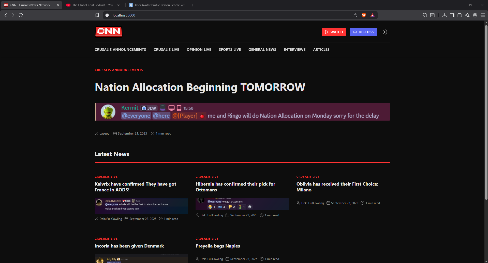

# CNN Frontend

Website made for CNN (Crusalis News Network).

# Repo structure
```
dist/             - build outputs
docs/             - documentation
public/           - static assets (e.g. icons, ...)
src/    
 ├─ css/           - css files
 ├─ js/            - js files
```

# Requirements/Installation
## Requirements:
- node.js

## Installation
1. Download/install node.js and npm: <https://nodejs.org/en/download>

2. Install npm packages:
```
npm install
```

# Development
1. Run `npm run dev` in this repo root to start dev environment.
2. Go to `localhost:3000` for main testing page.

# Build for release
`npm run build`

Run in the repo root. This generates files in the `/dist` directory.
These are just static html/css/js files, so any basic web server can serve them.


# License
Licensed under [GNU GPLv3](https://www.gnu.org/licenses/gpl-3.0.en.html).
See [LICENSE](./LICENSE)